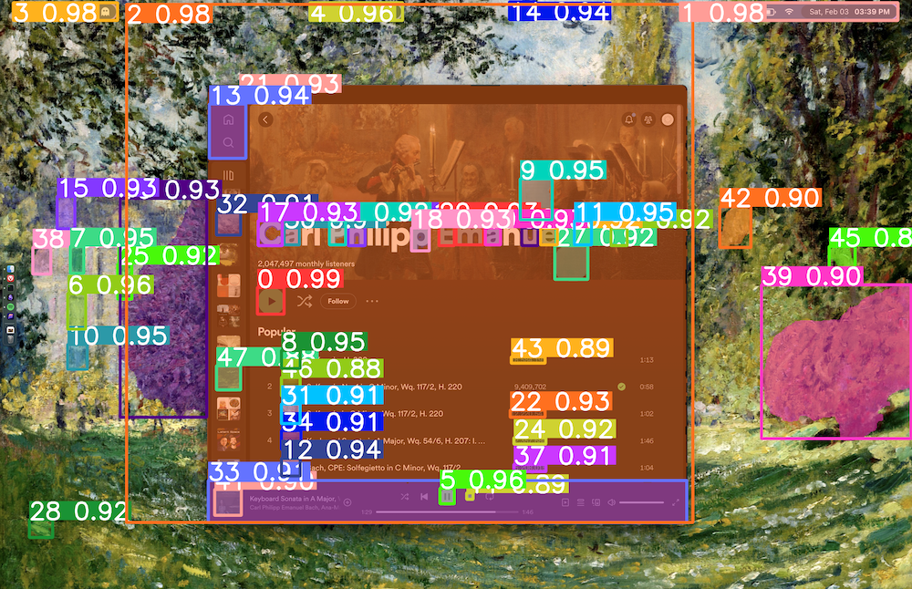

# Autonomous Computers

Date: February 3, 2024

There's a lot of interest in autonomously operating GUI's with multi-modal models (rabbit r1, and next gen Siri)

Sure, it would be more practical if you could do everything through the command line..

But in the end, you can't order Chipotle or file your taxes through the command line.

This being the case, I think there is a big opportunity for curating a GUI image segmentation dataset.

Current state-of-the-art vision and segmentation models- GPT4 vision, LLaVA, SAM, YOLO, etc, all struggle with these tasks (at least before fine-tuning)

Base SAM struggling to segment UI elements

Surprisingly smaller OCR (optical character recognition) models, like EasyOCR, excel at this task; but not all UI elements contain text.

Data collection would be somewhat straightforward- screenshots with bounding boxes produced by a click listener 🤔
