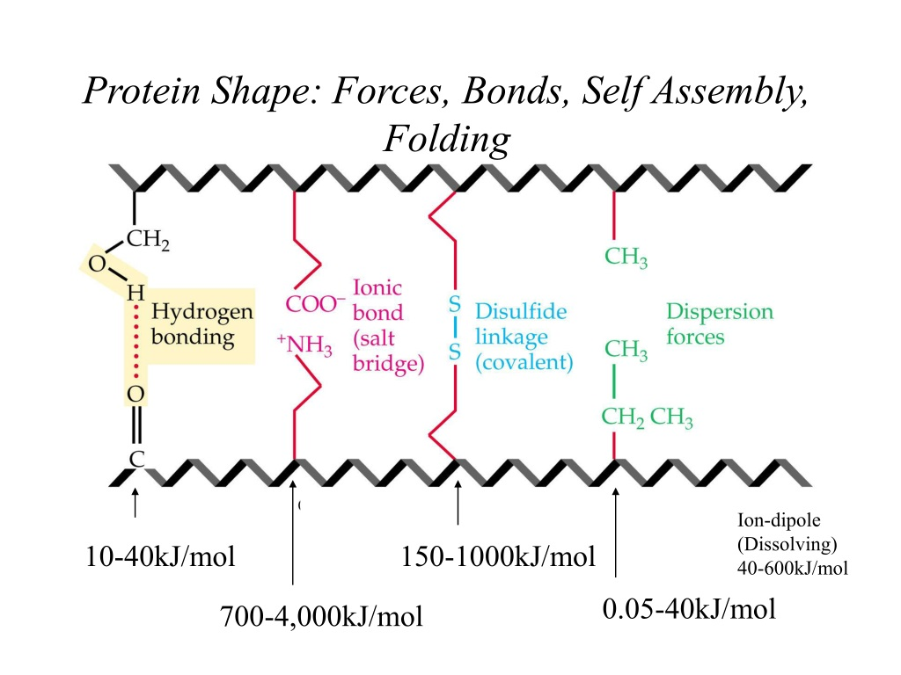
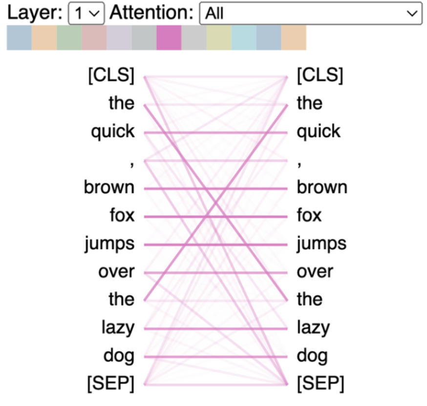

# Language Modeling is Crystallization ❄️

Date: January 21, 2024

My chemistry background tempts me to make a *very* rough analogy between protein folding/ crystallization and the construction of language by LLMs

Both processes construct high level complexity from atomic units.

Attention and syntax in language synthesis is similar to the van der Waals force and bond angles in crystallization.

Local interactions give rise to complex emergent properties of the larger system.

Protein crystallization structure is guided by a multitude of intramolecular forces

Transformer self-attention calculates relevance between tokens

In language, the emergent structures produced are sentence/ essay/ novel.
In crystallization, it is snowflakes/ zeolites/ protein crystals.

In reality, language synthesis is a more stochastic process, whereas crystallization is governed entirely by deterministic physical forces.

Leaving the analogy aside, the fact that language is computationally reducible *at all*, is absolutely mind blowing.
Especially considering that language is a construct created by humans, full of arbitrary syntactic and semantic conventions.

Yet somehow, there seem to be fundamental "laws of language" that enable it to be deterministically modeled by LLMs.

---

> *"It's as if we're discovering a new science- the science of the emergent properties of LLMs.*
> 
> 
> *For instance, LLM's have a temperature parameter that determines how tightly or loosely the network's output abides by it's statistical predictions.
> A low temperature results in a deterministic output.
> A high temperature results in incoherent language.*
> 
> *But there is a goldilocks temperature range that generative models like GPT-4 use, where the perfect balance of creativity and coherent language is achieved.*
> 
> *When the model's temperature is changed, it's as if the model goes through a phase change similar to matter."*
> 
> -Stephen Wolfram (paraphrased)
>
