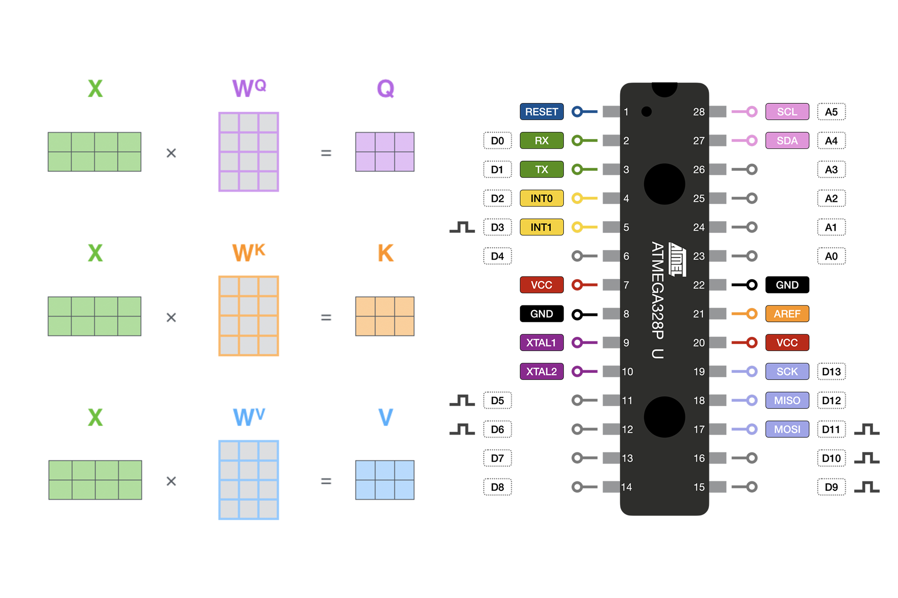
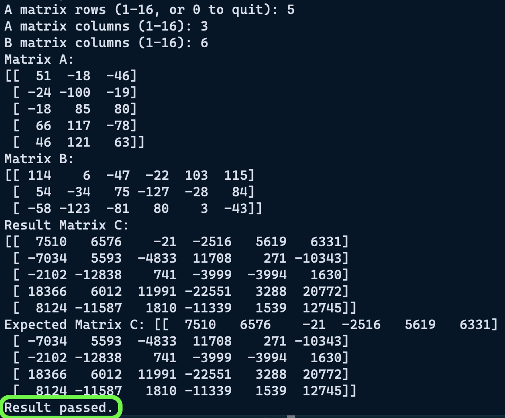

# Running an LLM on a $2 Microcontroller
*Memory is all you need!*

---

I took a weekend and tried to get an LLM running on an 8bit microcontroller- the ATmega328p in particular.

This was of course an exercise in futility that turned into a simpler ambition of getting the self-attention math working on the chip
It ballooned into several weeks of researching matrix multiplication kernels, quantization, and solid state memory.

I wanted to take this as far as possible so I could understand, at a fundamental level, what the minimum resources are to run one of these models.

>“What I cannot build, I do not understand” -Feynman


::: info Overview
What:
- Running modern LLM's, even the smallest ones, requires a generous amount of memory, typically on the order of 10's or 100's of GB's
- The ATmega328P is a $2 chip, with 2KB of memory (0.00000025 GB)
- The Atmega has none of the parallelism or multi-threading that modern GPU's and CPU's have, but it is capable of performing basic integer math
- Roughly analogous to how RAM works in GPU's and CPU's, I was able to expand the working memory of the ATmega with an SD card
- Getting an entire LLM running on this chip is infeasible (it would take hours to produce a single token), but I did succeed in implementing Self-Attention calculations on the chip

Why:
- AI will become prolific and embedded in many edge devices
- Many applications are power constrained or do not require a full-fledged operating system to perform tasks
- Implementing an LLM on such a resource constrained board helped me understand the minimum requirements needed for real-world embedded applications
:::
## Part 1: Setting up a math validation tool
I wanted to start simple to see what math I could feasibly do on the chip; that meant multiplying just two numbers.

The easiest way to do this was to input numbers to a computer, send to the chip for calculation, get the result back, and validate it the result.

I did this through a basic python client, and serial communication.

::: details  Python client:
```python
import serial
import time

def send_numbers(ser, a, b):
    ser.write(bytes([a + 128, b + 128]))

def receive_result(ser):
    return int(ser.readline().decode().strip())

ser = serial.Serial("/dev/tty.usbmodem2101", 9600, timeout=1)
time.sleep(2)

print("Connected to Arduino. Ready...")

while True:
    try:
        a = int(input("Enter first number (-128 to 127): "))

        b = int(input("Enter second number (-128 to 127): "))

        print(f"\nMultiplying {a} and {b}")

        send_numbers(ser, a, b)

        arduino_result = receive_result(ser)

        expected_result = a * b

        print(f"Arduino result: {arduino_result}")
        print(f"Expected result: {expected_result}")

        if arduino_result == expected_result:
            print("Result passed.")
        else:
            print("Result failed.")

ser.close()
print("Connection closed.")

```
:::

ATmega program:
```c
#include <stdint.h>

#define BAUD 9600
#define F_CPU 16000000UL
#define UBRR_VALUE ((F_CPU / (BAUD * 16UL)) - 1)

//serial communication setup
void uart_init() {
  UBRR0H = (uint8_t)(UBRR_VALUE >> 8);
  UBRR0L = (uint8_t)UBRR_VALUE;
  UCSR0B = (1 << RXEN0) | (1 << TXEN0);
  UCSR0C = (3 << UCSZ00);
}

void uart_transmit(uint8_t data) {
  while (!(UCSR0A & (1 << UDRE0)))
    ;
  UDR0 = data;
}

uint8_t uart_receive() {
  while (!(UCSR0A & (1 << RXC0)))
    ;
  return UDR0;
}

void uart_print_number(int16_t num) {
  char buffer[7];
  itoa(num, buffer, 10);
  for (char *p = buffer; *p; p++) {
    uart_transmit(*p);
  }
  uart_transmit('\n'); 
}

int main(void) {
  uart_init();

  while (1) {
    int8_t A = (int8_t)uart_receive() - 128;
    int8_t B = (int8_t)uart_receive() - 128;

    int16_t C = (int16_t)A * B;

    uart_print_number(C);
  }

  return 0;
}
```

I setup everything under the assumption that I would eventually be using an 8bit quantized model.

This enables me to work primarily with signed integers (ranging from -128 to 127), instead of floating point numbers.

I used the int8 data type and shifted values to be between -128 and 127.

Outputs can overflow into the 16bit range.


Once this was working, and the validation tests were passing, I felt comfortable expanding this to matrix multiplication.
## Part 2: Matrix Multiplication
If I could multiply two numbers, I felt it would be pretty straightforward to extend it to a matrix.

I started with 2D matrices.

For the sake of simplicity, I flattened 2D matrices into 1D arrays.

This enabled memory to be easily allocated and accessed in contiguous blocks.

Indexing into a value can be done with with: `matrix[i * size + k]` Where `i` is the row index, `size` is the column dimension, and `k` is the column index

For the matrix multiplication "kernel'", I used a brute force loop approach, borrowed from [here](https://forum.arduino.cc/t/arduino-matrix-math-library/38123).

```c
void matmult(int8_t *A, int8_t *B, int16_t *C, uint8_t rows_A,
                     uint8_t cols_A, uint8_t cols_B) {
  for (uint8_t i = 0; i < rows_A; i++) {
    for (uint8_t j = 0; j < cols_B; j++) {
      int32_t sum = 0;
      for (uint8_t k = 0; k < cols_A; k++) {
        sum += (int32_t)A[i * cols_A + k] * B[k * cols_B + j];
      }
      C[i * cols_B + j] = (int16_t)sum;
    }
  }
}
```

Because the values are stored inside of 1D arrays the dimensions of the matrices need to be explicitly passed in. 

I generated matrices with numpy, and used `np.array_equal()` to validate the results returned by the chip.

::: details  Python client:
```python
import time
import numpy as np
import serial


def send_matrix(ser, matrix):
    for value in matrix.flatten():
        ser.write(bytes([value + 128]))


def receive_matrix(ser, rows, cols):
    matrix = np.zeros((rows, cols), dtype=np.int16)
    for i in range(rows):
        for j in range(cols):
            value_str = ser.readline().decode().strip()
            matrix[i, j] = int(value_str)
    return matrix


ser = serial.Serial("/dev/tty.usbmodem2101", 9600, timeout=5)
time.sleep(2)

print("Connected...")

while True:
    rows_A = int(input("A matrix rows (1-16, or 0 to quit): "))
    cols_A = int(input("A matrix columns (1-16): "))
    cols_B = int(input("B matrix columns (1-16): "))

    A = np.random.randint(-128, 127, (rows_A, cols_A), dtype=np.int8)
    B = np.random.randint(-128, 127, (cols_A, cols_B), dtype=np.int8)

    print("Matrix A:")
    print(A)
    print("Matrix B:")
    print(B)

    # Send size and matrices
    ser.write(bytes([rows_A]))
    ser.write(bytes([cols_A]))
    ser.write(bytes([cols_B]))
    send_matrix(ser, A)
    send_matrix(ser, B)

    C = receive_matrix(ser, rows_A, cols_B)

    print("Result Matrix C:")
    print(C)

    expected = np.matmul(A.astype(np.int32), B.astype(np.int32)).astype(np.int16)
    print(f"Expected Matrix C: {expected}")
    if np.array_equal(C, expected):
        print("Result passed.")
    else:
        print("Result failed")
        print("Expected:")
        print(expected)
        print("Difference:")
        print(C - expected)

ser.close()
print("Connection closed.")
```
:::

It took several hours of debugging to get this working; the math was wrong every time.

I really handicapped myself by writing my serial communication from scratch; 

It was a pain figuring out if my problems were math, memory management or data transfer related (turns out it was the latter..)

After several iterations of deleting and restarting from my basic multiplication example, I finally got my tests to pass on square matrices, and then finally matrices of varying dimensions.


This is where I ran into my first concrete roadblock; the one that I understood most easily from the beginning: The atmega328p has 2kB of RAM/ volatile memory.

This means it can hold a theoretical maximum of 2048 int8 values, or just one 45x45 int8 matrix. 

Mat-Mult requires allocation for 3 matrices, the third being int16 or int32 (because mat-mult of large int8 matrices could result in numbers higher than 32,768), so the maximum allowable dimension for each matrix is quite small.

My goal from the beginning was never to run this *entirely* on the ATmega, but to offload memory onto pseudo ram, ie repurposed solid state storage like an SD card.

In my naive outlook, there isn't anything *fundamentally* different about volatile memory and solid state memory, they're both just storing bits somewhere 🤷

Sure there are many differences in speed and how data is accessed, but I felt I could at least implement a toy example for my own curiosity.
## Part 3: Memory Offloading
My next goal was to scale the mat-mult as far as I could using memory offloading; and maybe even simulate the first mat-mult operation of a small Llama model.

I intended on storing runtime memory on an SD card, so I can handle very large matrices.


I found several possible approaches to this- There is the very impractical approach of writing directly at the block level, in 512 byte chunks, with something like the SDFat library.

This appears to require a lot of attention to wear-leveling and block management.

The more feasible approach is to work with a file system abstraction- simply creating and appending to .txt files.

To set this up I extracted the first attention head weights (768 , 768 each) from the GPT2 model.

I also created an embedded+normalized token sequence (7 , 768).

I saved each of these matrices to a binary file.


My next goal was to successfully calculate the Q, K, and V matrices with memory offloading/ without overflowing the ATmega's memory.

My initial approach for memory offloading was as follow: 
- Open weight and input files from the SD
- Read and multiply element-wise
- Store the intermediate multiplication values on the SD in a temp.bin file
- Once all multiplication is complete, open the temp.bin file
- Read and sum the row chunks, for final mat-mul result
- Store resulting matrix in an output.bin file

For my 7 token sequence, this would take about 4,128,768 multiplication and write operations, then another 4,128,768 read, addition, and final output write operations;
just for the Q matrix! 

I will probably eventually need to implement some type of chunking scheme to reduce the read/write ops

::: info Sidenote:

I had hoped to implement the SD card communication from scratch like I did with the UART communication, but it appears to be a bit more complicated.

Bringing in the arduino SD library would be simpler, but it is leading to a web of other arduino dependencies which I really do not want to bring into this project.

The SD library provides very helpful methods like seek(), so I think it will be indispensable to this project, I just need to get it compiled with avr-gcc/ working outside of the arduino IDE ecosystem
:::

::: info Sidenote 2:

Interesting note, the SD card library provides these convenient methods- seek(), read(), and write()- that appear to operate on linear chunks of memory, but actually operate through a "Flash Translation Layer" on the SD card.

This abstraction layer translates logical memory addresses to random physical locations on the flash memory, spreading out writes across the card, preventing any one area from wearing out prematurely
:::

It turns out, using the arduino SD card library outside of the arduino ecosystem is impractical, there are just too many extraneous dependencies.

So I had to resort to using the arduino-cli instead of avr-gcc

But I successfully setup the SD card and got basic multiplication working.
Now to load in some large matrices
## Part 4: Attention Layer
### A note on quantization
>Typically only the weights that participate in matmuls are quantized. All the other parameters (e.g. especially the scale and bias in RMSNorm) are kept in float32, because these layers are very sensitive. Here, we go one step further and additionally quantize the activations in the forward pass. This requires us to dynamically quantize and dequantize between float32 and int8 at runtime, which adds overhead. But the benefit is that now the majority of the calculations are using pure integer arithmetic.
>
>[Karpathy, discussing llama2.c](https://github.com/karpathy/llama2.c?tab=readme-ov-file#int8-quantization)

The ATmega does not have dedicated Floating Point math hardware but can do floating point math through software, which can take several hundred clock cycles to complete a simple operation.

While matrix multiplication can be broken down into piece-wise operations, there are ops where an entire row or matrix needs to be in memory, like softmax.

## Closing Thoughts
My main goal in this project was to better understand the minimum requirements necessary to run state-of-the-art language models.

The biggest insight I gained is that <ins>memory is the only constraint</ins>.
GPU's perform calculation much faster, but they are not strictly necessary.
